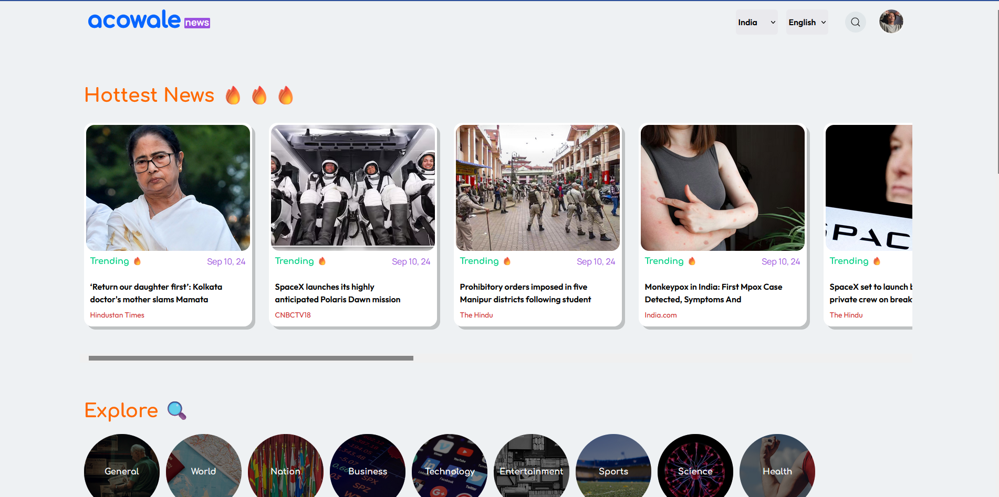
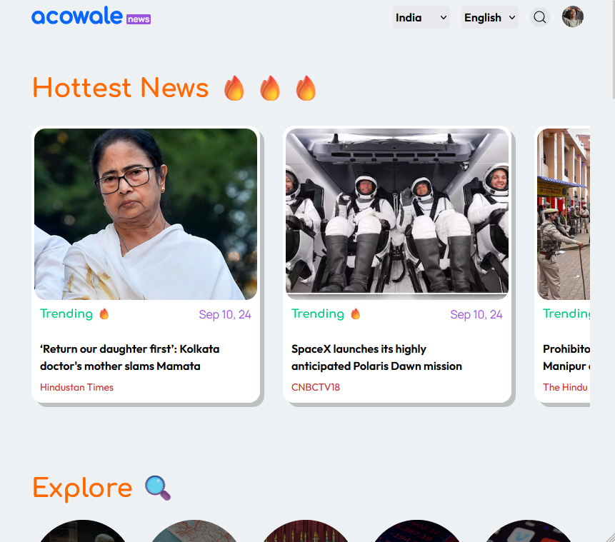
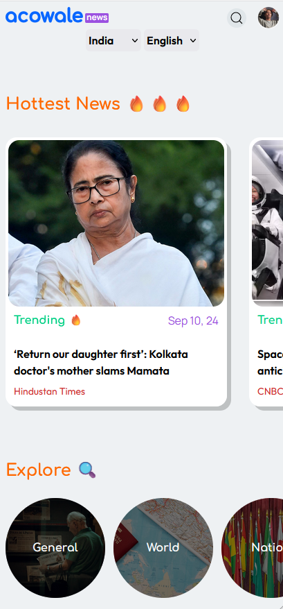

# Aconews

## Screenshots

## Table of contents

- [Overview](#overview)
  - [About](#about)
  - [Features](#features)
  - [Problems](#problems)
  - [Links](#links)
- [Resources](#resources)
  - [API](#api)
  - [Dependencies](#dependencies)
  - [References](#references)
- [Future-plans](#future-plans)

---

## Overview

Aconews is a minimalist news feed app created with React and Node/express.

### About

I have used Vite for instant React project creation, TailwindCSS for styling, React-router for basic single-page routing, and Node.js with Express.js for creating backend services for managing Gnews APIs. I have used Acowale's official site to get ideas regarding typography, colors, fonts, and styling references. I have chosen a mobile-first approach for responsive layouts, which is also compatible with all screens thanks to Tailwind responsive design classes. I have created responsive layouts using dummy data and implemented page routes and the react-loading-skeleton npm package for loading state.

I have created a home page that shows trending articles, category filters, and a news feed, created a search component for getting debounced results of news articles, and created filters for choosing country and language/region-specific news. Users can filter out news based on categories.

For the cloud implementation, I have to use Vercel for hosting. For API calls, I have created different router files for creating two endpoints, i.e., fetchTrendingNews and fetchSearchNews. For implementing these endpoints, I have used promises, try-catch, async-await blocks, and axios to fetch data from the Gnews API.

### Features

- Trending and news feed section,
- Filter news by Language, category and country,
- Search component for getting latest news feed by keywords,
- Pagination based on categories(API doesn't).

### Problems

The issues I have faced and the ways I've solved them are as follows:

- Firebase doesn't support functions and app hosting for free-tier plans, so I have used Vercel for hosting front-end and back-end using Github integration,
- API doesn't support pagination for free, and I had to use API calls sparsely because of 100 requests every 24 hours and 10 articles per call limit. That's why I have simply used the same API calls to create a makeshift previous and next button for fetching new articles,
- React loading skeleton only worked when I had a conditionally rendered skeleton component for each of the trending and articles cards. i.e., only render card when data is present; otherwise, render skeleton component,
- For managing API overheads in the search bar, I have used debouncing for minimizing API calls, and I should've used the debouncing function in all my API calls,
- I wasn't sure how to implement filters, so I have used a state function for holding all API endpoints so that I can re-render components every time I have used filters of any sort.

### Links

- Vercel URL: [https://mrrobotaconews.vercel.app/]

---

## Resources

### API

- `gnews.io`: For getting short list of news feeds and simple description data,

### Dependencies

- TailwindCSS `v3.4.10`,
- React-router `v6.26.1`,
- React-loading-skeleton `v3.4.0`,
- Axios `v1.7.7`,
- express `v4.19.2`,

### References

- **[MDN](https://developers.mozilla.org)** - Everything WEB.
- **[react.dev](https://react.dev)** - Everything React.
- **[tailwindCSS](https://tailwindcss.com)** - Everything CSS
- **[javascript.info](https://javascript.info)** - Everything JavaScript.
- **[CSSTricks](https://css-tricks.com)** - Everything CSS tutorials.

---

## Future-plans

- Animations using framer motion,
- More api's for getting more kinds of data,
- Redux for storing data within the project,
- TanStack Query replacing axios,
- GraphQL for managing and modularizing API related queries.
